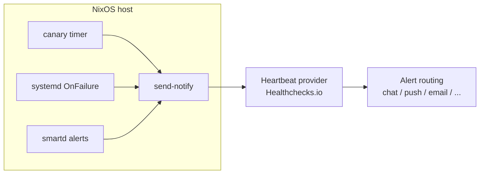

[](https://github.com/dbast/nixos-monitoring-lite/actions/workflows/check.yml)

# nixos-monitoring-lite

Tiny event-forwarding monitoring for NixOS hosts and NAS systems.

It connects existing system signals (`systemd` failures, SMART alerts, and a canary heartbeat) to an external monitoring state machine such as Healthchecks.io. No scraper, no dashboard, no local metrics database, no log aggregation pipeline, no long-running monitoring agent.



## Architecture

- Traditional Unix monitoring often relies on direct local mail delivery; this setup sends HTTP events to a remote state machine that handles state transitions and routes alerts to modern channels in real time.
- On systemd-based hosts, `OnFailure` reuses systemd's native failure-event flow without changing service logic; failed backups, scrubs, replication jobs, or any other units can emit failure events over the same path.
- The canary heartbeat proves the host is reachable and scheduled checks still run; disk usage, Btrfs/mdraid state, optional failed-unit logs, and SMART fields are triage context layered onto that core signal.
- Scope boundary: this project forwards high-value state transitions; it intentionally does not implement a scraper/metrics/dashboard monitoring stack.

## What It Monitors

- `canary`: machine is running, internet egress works, and storage context indicates capacity/array/filesystem health.
- `systemdFail`: backup/scrub/replication/other critical services notify on failure; no failure signal means those service paths are healthy.
- `smartd`: disk-hardware failures are surfaced quickly, covering the most critical hardware risk for data loss on NAS systems.

The result is tiny local overhead with strong monitoring coverage for high-value failure modes.

## Provider Support

- Supported: `Healthchecks.io`
- Planned: `Cronitor`, `Better Stack` heartbeat monitors
- Extension point: all modules call `modules/send-notify.nix` with provider/status/message/url arguments, so provider-specific request logic is centralized.

Healthchecks.io fits this model well: it listens for HTTP pings, stays quiet while pings arrive on time, and alerts when a check is late, missing, or explicitly failed. Its integrations provide routing, redundancy, and escalation through chat, push, email, webhooks, and incident tools.

## Modules

- `nixosModules.canary`: daily heartbeat with disk usage, Btrfs device health, and mdraid state context.
- `nixosModules.systemd-fail`: attaches failure pings to selected systemd units through `OnFailure`.
- `nixosModules.smartd`: forwards `smartd` alerts and can run standby-aware SMART short self-tests.
- `nixosModules.default`: imports all modules; each feature still has its own `enable` option.

## Quick Start

```nix
{
  inputs.nixpkgs.url = "github:NixOS/nixpkgs/nixos-25.11";
  inputs.nixos-monitoring-lite.url = "github:YOUR_GITHUB_USER/nixos-monitoring-lite";
  inputs.nixos-monitoring-lite.inputs.nixpkgs.follows = "nixpkgs";

  outputs = { nixpkgs, nixos-monitoring-lite, ... }: {
    nixosConfigurations.host = nixpkgs.lib.nixosSystem {
      system = "x86_64-linux";
      modules = [
        nixos-monitoring-lite.nixosModules.default
        {
          services.monitoringLite.canary = {
            enable = true;
            urlFile = "/run/secrets/healthchecks/canary.url";
            disks = [ "/" "/data" ];
            threshold = 80;
          };

          services.monitoringLite.systemdFail = {
            enable = true;
            urlFile = "/run/secrets/healthchecks/systemd-failure.url";
            services = [ "backup" "syncthing" ];
          };

          services.monitoringLite.smartd = {
            enable = true;
            urlFile = "/run/secrets/healthchecks/smartd.url";
            shortSelfTest = {
              enable = true;
              triggerAfterUnits = [ "btrfs-scrub@data" ];
            };
          };
        }
      ];
    };
  };
}
```

Each `urlFile` contains a base provider ping URL.

- Plain file: `urlFile = "/etc/healthchecks/canary.url";`
- sops-nix: `urlFile = config.sops.secrets.hcCanaryUrl.path;`
- agenix: `urlFile = config.age.secrets.hcCanaryUrl.path;`

The module only consumes filesystem paths, so it has no runtime dependency on sops-nix or agenix.

## Operations

### Test `systemdFail`

Enable the built-in demo failing service:

```nix
{
  services.monitoringLite.systemdFail = {
    enable = true;
    enableDemo = true;
    urlFile = "/run/secrets/healthchecks/systemd-failure.url";
  };
}
```

Trigger a failure event:

```sh
sudo systemctl start monitoring-lite-fail-demo.service
```

That runs the same `OnFailure` path used by real monitored services.

By default, failure payloads include service identity, host name, systemd result fields, load average, available memory, and root filesystem usage. Journal excerpts are not sent unless explicitly enabled:

```nix
{
  services.monitoringLite.systemdFail = {
    includeJournal = true;
    journalLines = 50;
  };
}
```

Only enable this for units whose logs are safe to leave the machine.

### Test `smartd`

Enable SMART test mode:

```nix
{
  services.monitoringLite.smartd = {
    enable = true;
    testMode = true;
    urlFile = "/run/secrets/healthchecks/smartd.url";
  };
}
```

`testMode` adds `-M test` to `smartd` and enables a deterministic synthetic alert service:

```sh
sudo systemctl start monitoring-lite-smartd-test-alert.service
```

### Mark Green After Tests Or Fixes

Healthchecks.io checks that receive `/fail` stay red until a normal ping is sent again.

- `canary` recovers automatically on the next successful timer run.
- `systemdFail` and `smartd` include manual recovery services.

```sh
sudo systemctl start monitoring-lite-systemd-fail-ok.service
sudo systemctl start monitoring-lite-smartd-ok.service
```

Customize the recovery payload text with:

- `services.monitoringLite.systemdFail.okMessage`
- `services.monitoringLite.smartd.okMessage`

## SMART Self-Tests

`smartd` remains responsible for observing and reporting SMART failures. The optional short-self-test service only starts tests with `smartctl`; it does not decide whether SMART passed or failed.

The intended pattern is to trigger SMART short self-tests after another periodic job that already wakes disks (for example a scrub). This avoids spinning up standby disks solely for monitoring and gives `smartd` time to poll active disks and emit alerts when needed.

The short-self-test invocation remains standby-aware (`smartctl -n standby`), so unexpectedly sleeping disks are skipped rather than force-woken by this module.

## Optional Proxy Egress

Proxying is generic and optional. Point each module at any proxy URL:

```nix
{
  services.monitoringLite.canary.proxy = "http://proxy.example:3128";
  services.monitoringLite.systemdFail.proxy = "http://proxy.example:3128";
  services.monitoringLite.smartd.proxy = "http://proxy.example:3128";
}
```

If you choose Tor, provide your own NixOS Tor config and pass its `socks5h://...` URL here. Payload contents can still identify the host and workload.

## Payload Privacy

This project sends operational context to an external provider. Treat payloads as data leaving the machine, not as opaque heartbeat metadata.

- `canary` payloads can include host reachability, mount points, disk usage, Btrfs state, and mdraid state.
- `systemdFail` payloads include host name, failed unit name, systemd result fields, load average, memory availability, and root filesystem usage.
- `systemdFail.includeJournal = true` additionally sends recent journal lines from the failed invocation. This is disabled by default because logs can contain paths, user data, tokens, request details, or application payloads.
- `smartd` payloads include SMART device identifiers and `smartd` failure messages.
- A proxy or Tor changes the network path, not the sensitivity of the payload body.

## Development

```sh
nix flake check --print-build-logs
```

Checks include eval coverage for each module, aggregate-module eval coverage, Btrfs/non-Btrfs dependency checks, `shellcheck` against generated service scripts, and an x86_64-linux VM integration test with a local HTTP mock provider.

## Lineage

- The systemd failure path follows the classic `OnFailure=handler@%n.service` pattern: failed units fan out into a reusable handler template with unit context.
- The Healthchecks.io/systemd pattern is extended here for NixOS modules, systemd monitor variables, recent journal output, SMART alerts, and a shared provider sender.

## References

- https://healthchecks.io/docs/
- https://healthchecks.io/docs/configuring_notifications/
- https://northernlightlabs.se/2014-07-05/systemd-status-mail-on-unit-failure.html
- https://passbe.com/2022/healthchecks-io-systemd-checks/

## License

MIT
