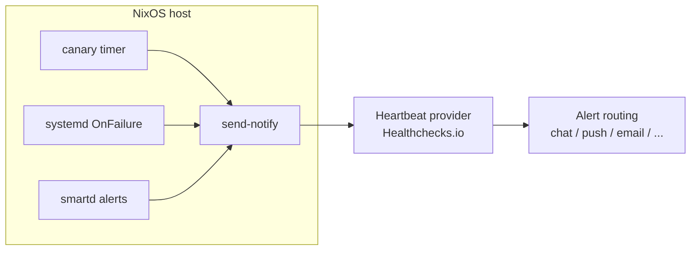

# nixos-monitoring-lite

[](https://github.com/dbast/nixos-monitoring-lite/releases/latest)
[](https://github.com/dbast/nixos-monitoring-lite/actions/workflows/check.yml)
[](https://deepwiki.com/dbast/nixos-monitoring-lite)

Tiny event-forwarding monitoring for NixOS hosts and NAS systems.

It connects existing system signals (`systemd` failures, SMART alerts, and a canary heartbeat) to an external monitoring state machine such as Healthchecks.io. No scraper, no dashboard, no local metrics database, no log aggregation pipeline, no long-running monitoring agent.



## Architecture

- Traditional Unix monitoring often relies on direct local mail delivery; this setup sends HTTP events to a remote state machine that handles state transitions and routes alerts to modern channels in real time.
- On systemd-based hosts, `OnFailure` reuses systemd's native failure-event flow without changing service logic; failed backups, scrubs, replication jobs, or any other units can emit failure events over the same path.
- The canary heartbeat proves the host is reachable and scheduled checks still run; nixpkgs age, pending reboot state, disk usage, Btrfs/mdraid state, optional failed-unit logs, and SMART fields are triage context layered onto that core signal.
- Scope boundary: this project forwards high-value state transitions; it intentionally does not implement a scraper/metrics/dashboard monitoring stack.

## What It Monitors

- `canary`: machine is running, internet egress works, the nixpkgs snapshot is recent, no kernel/initrd/modules reboot is pending, and storage context indicates capacity/array/filesystem health.
- `systemdFail`: selected backup/scrub/replication/other critical services notify when they enter failure; this is an event path, not a positive health check.
- `smartd`: disk-hardware failures are surfaced quickly, covering the most critical hardware risk for data loss on NAS systems.

The result is tiny local overhead with strong monitoring coverage for high-value failure modes.

## Provider Support

- Supported: `Healthchecks.io`
- Planned: `Cronitor`, `Better Stack` heartbeat monitors
- Extension point: all modules call `modules/send-notify.nix` with provider/status/message/url arguments, so provider-specific request logic is centralized.

Healthchecks.io fits this model well: it listens for HTTP pings, stays quiet while pings arrive on time, and alerts when a check is late, missing, or explicitly failed. Its integrations provide routing, redundancy, and escalation through chat, push, email, webhooks, and incident tools.

## Modules

- `nixosModules.canary`: daily heartbeat with nixpkgs snapshot age, pending reboot state, disk usage, Btrfs device health, mdraid state context, and optional host-specific context snippets.
- `nixosModules.systemd-fail`: attaches failure pings to selected systemd units through `OnFailure`.
- `nixosModules.smartd`: forwards `smartd` alerts and can run standby-aware SMART short self-tests.
- `nixosModules.default`: imports all modules; each feature still has its own `enable` option.

## Quick Start

```nix
{
  inputs.nixpkgs.url = "github:NixOS/nixpkgs/nixos-26.05";
  inputs.nixos-monitoring-lite.url = "github:dbast/nixos-monitoring-lite";
  inputs.nixos-monitoring-lite.inputs.nixpkgs.follows = "nixpkgs";

  outputs = { self, nixpkgs, nixos-monitoring-lite, ... }: {
    nixosConfigurations.host = nixpkgs.lib.nixosSystem {
      system = "x86_64-linux";
      modules = [
        nixos-monitoring-lite.nixosModules.default
        {
          system.configurationRevision = self.sourceInfo.rev or null;

          services.monitoringLite.canary = {
            enable = true;
            urlFile = "/run/secrets/healthchecks/canary.url";
            disks = [ "/" "/data" ];
            threshold = 80;
            nixpkgsMaxAgeDays = 30;
          };

          services.monitoringLite.systemdFail = {
            enable = true;
            urlFile = "/run/secrets/healthchecks/systemd-failure.url";
            services = [ "backup" "syncthing" ];
          };

          services.monitoringLite.smartd = {
            enable = true;
            urlFile = "/run/secrets/healthchecks/smartd.url";
            shortSelfTest = {
              enable = true;
              triggerAfterUnits = [ "btrfs-scrub@data" ];
            };
          };
        }
      ];
    };
  };
}
```

Each `urlFile` contains a base provider ping URL.

Every payload, including recovery pings, ends with `NixOS: ` followed by the complete output of `nixos-version --json`. This currently identifies the running `nixosVersion`, `nixpkgsRevision`, and, when configured, `configurationRevision`.

`configurationRevision` identifies the top-level configuration repository rather than nixpkgs. NixOS leaves it unset unless your configuration supplies `system.configurationRevision`; for a flake, use `self.sourceInfo.rev or null` as shown above. Build from a clean committed Git revision so `self.sourceInfo.rev` exists. When the value is `null`, `nixos-version --json` omits `configurationRevision`.

Use a distinct provider check and URL for each feature so their failure and recovery states do not collide. Treat these URLs as credentials and keep their files protected.

- Plain file: `urlFile = "/etc/healthchecks/canary.url";`
- sops-nix: `urlFile = config.sops.secrets.hcCanaryUrl.path;`
- agenix: `urlFile = config.age.secrets.hcCanaryUrl.path;`

The module only consumes filesystem paths, so it has no runtime dependency on sops-nix or agenix.

`systemdFail.services` values are NixOS `systemd.services` attribute names such as `backup`, not full unit names such as `backup.service`.

## Operations

Delivery uses bounded HTTP retries but no durable local queue. After an outage, rerun the relevant oneshot or recovery service if an event was not delivered.

Host-only nixpkgs-age and reboot signals are reported as `unknown` without failing the canary when unavailable, such as in NixOS integration tests or containers. Known stale snapshots and pending reboots still send failure pings.

Set `services.monitoringLite.canary.nixpkgsMaxAgeDays = 0` to disable the nixpkgs-age check, for example in an end-to-end test configuration.

### Test `systemdFail`

Enable the built-in demo failing service:

```nix
{
  services.monitoringLite.systemdFail = {
    enable = true;
    enableDemo = true;
    urlFile = "/run/secrets/healthchecks/systemd-failure.url";
  };
}
```

Trigger a failure event:

```sh
sudo systemctl start monitoring-lite-fail-demo.service
```

That runs the same `OnFailure` path used by real monitored services.

By default, failure payloads include service identity, host name, systemd result fields, load average, available memory, and root filesystem usage. Journal excerpts are not sent unless explicitly enabled:

```nix
{
  services.monitoringLite.systemdFail = {
    includeJournal = true;
    journalLines = 50;
  };
}
```

Only enable this for units whose logs are safe to leave the machine.

### Test `smartd`

Enable SMART test mode:

```nix
{
  services.monitoringLite.smartd = {
    enable = true;
    testMode = true;
    urlFile = "/run/secrets/healthchecks/smartd.url";
  };
}
```

`testMode` adds `-M test` to `smartd` and enables a deterministic synthetic alert service:

```sh
sudo systemctl start monitoring-lite-smartd-test-alert.service
```

### Mark Green After Tests Or Fixes

Healthchecks.io checks that receive `/fail` stay red until a normal ping is sent again.

- `canary` recovers automatically on the next successful timer run.
- `systemdFail` and `smartd` include manual recovery services.

```sh
sudo systemctl start monitoring-lite-systemd-fail-ok.service
sudo systemctl start monitoring-lite-smartd-ok.service
```

Customize the recovery payload text with:

- `services.monitoringLite.systemdFail.okMessage`
- `services.monitoringLite.smartd.okMessage`

### Canary Extra Context

Add small host-specific canary context with `services.monitoringLite.canary.extraContext` instead of baking service-specific logic into this module. Each entry is a named shell script that should emit one short line. Its combined stdout and stderr is appended to the canary payload under `Context:`; if it exits non-zero, the canary sends a failure ping.

Use this as a lightweight triage-context escape hatch. It is not a metrics scraper, dashboard, or time-series database; use Prometheus or another metrics stack for rate queries and historical analysis.

Prometheus text endpoints are a useful source for these snippets because many serious services expose them. The canary still only sends the current one-shot summary; it does not scrape, store, graph, or evaluate time-series data.

Example Blocky Prometheus scrape:

```nix
{ pkgs, ... }:
{
  services.monitoringLite.canary.extraContext.blocky = {
    runtimeInputs = [
      pkgs.jq
      pkgs.prom2json
    ];
    script = ''
      prom2json http://127.0.0.1:4000/metrics | jq -r '
        def metric($n): map(select(.name == $n)) | .[0].metrics;
        def sumMetric($n): (metric($n) | map(.value | tonumber) | add) // 0;
        def value($n): (metric($n)[0].value | tonumber) // 0;
        def sumLabel($n; $k; $v):
          (metric($n) | map(select(.labels[$k] == $v) | .value | tonumber) | add) // 0;

        "version=\((metric("blocky_build_info")[0].labels.version) // "unknown") blocking=\(value("blocky_blocking_enabled")) queries=\(sumMetric("blocky_query_total")) blocked=\(sumLabel("blocky_response_total"; "response_type"; "BLOCKED")) cache_hits=\(value("blocky_cache_hits_total")) cache_misses=\(value("blocky_cache_misses_total")) errors=\(value("blocky_error_total")) failed_downloads=\(value("blocky_failed_downloads_total"))"
      '
    '';
  };
}
```

This emits context like `blocky:version=0.29.0 blocking=1 queries=18885 blocked=5205 cache_hits=34596 cache_misses=4339 errors=0 failed_downloads=8`. Adjust the endpoint and metric names to match your Blocky version/configuration.

## SMART Self-Tests

`smartd` remains responsible for observing and reporting SMART failures. The optional short-self-test service only starts tests with `smartctl`; it does not decide whether SMART passed or failed.

The intended pattern is to trigger SMART short self-tests after another periodic job that already wakes disks (for example a scrub). This avoids spinning up standby disks solely for monitoring and gives `smartd` time to poll active disks and emit alerts when needed.

The short-self-test invocation remains standby-aware (`smartctl -n standby`), so unexpectedly sleeping disks are skipped rather than force-woken by this module.

## Optional Proxy Egress

Use systemd's native service environment for optional proxy egress:

```nix
{
  systemd.globalEnvironment.all_proxy = "socks5h://127.0.0.1:9050";
}
```

This applies to all system services. Set `systemd.services.<name>.environment.https_proxy` instead when only a specific monitoring service should use the proxy. Payload contents can still identify the host and workload.

## Payload Privacy

This project sends operational context to an external provider. Treat payloads as data leaving the machine, not as opaque heartbeat metadata.

- `canary` payloads can include host reachability, mount points, disk usage, Btrfs state, mdraid state, and any configured `extraContext` output.
- `systemdFail` payloads include host name, failed unit name, systemd result fields, load average, memory availability, and root filesystem usage.
- `systemdFail.includeJournal = true` additionally sends recent journal lines from the failed invocation. This is disabled by default because logs can contain paths, user data, tokens, request details, or application payloads.
- `smartd` payloads include SMART device identifiers and `smartd` failure messages.
- All payloads include the full `nixos-version --json` output, which can expose nixpkgs and configuration Git revisions.
- A proxy or Tor changes the network path, not the sensitivity of the payload body.

## Development

```sh
nix flake check --print-build-logs
```

Checks include eval coverage for each module, aggregate-module eval coverage, Btrfs/non-Btrfs dependency checks, `shellcheck` against generated service scripts, and an x86_64-linux VM integration test with a local HTTP mock provider.

## Lineage

- The systemd failure path follows the classic `OnFailure=handler@%n.service` pattern: failed units fan out into a reusable handler template with unit context.
- The Healthchecks.io/systemd pattern is extended here for NixOS modules, systemd monitor variables, recent journal output, SMART alerts, and a shared provider sender.

## References

- https://healthchecks.io/docs/
- https://healthchecks.io/docs/configuring_notifications/
- https://northernlightlabs.se/2014-07-05/systemd-status-mail-on-unit-failure.html
- https://passbe.com/2022/healthchecks-io-systemd-checks/

## License

MIT
